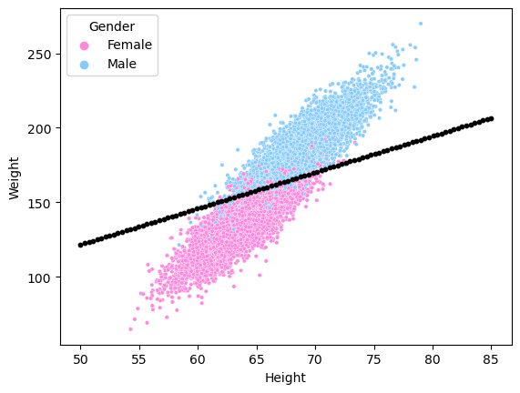

# Gender Prediction

Gender prediction project for Python 3.10 (conda)

## Applications

* [Miniconda](https://docs.conda.io/en/latest/miniconda.html "Miniconda download")
* [Visual Studio Code](https://code.visualstudio.com/download "Visual Studio Code download")
* [Jupyter Iteractive Extension for Visual Studio Code](https://marketplace.visualstudio.com/items?itemName=ms-toolsai.jupyter "Jupyter Extension for Visual Studio Code installation page")
* [ipykernel](https://pypi.org/project/ipykernel/ "ipykernel for Jupyter")
* [CUDA Toolkit 11.7](https://developer.nvidia.com/cuda-11-7-0-download-archive?target_os=Windows&target_arch=x86_64&target_version=10 "CUDA Toolkit 11.7 for Windows")
* `conda install pytorch torchvision torchaudio pytorch-cuda=11.7 -c pytorch -c nvidia`

## Required Libraries

* [pandas](https://pandas.pydata.org/)
* [NumPy](https://numpy.org/)
* [seaborn](https://seaborn.pydata.org/)
* [Matplotlib](https://matplotlib.org/)
* [scikit-learn](https://scikit-learn.org/stable/)

## Model Report

## Credits

Zain Hindi - Creator

Alex Akoopie - Creator
